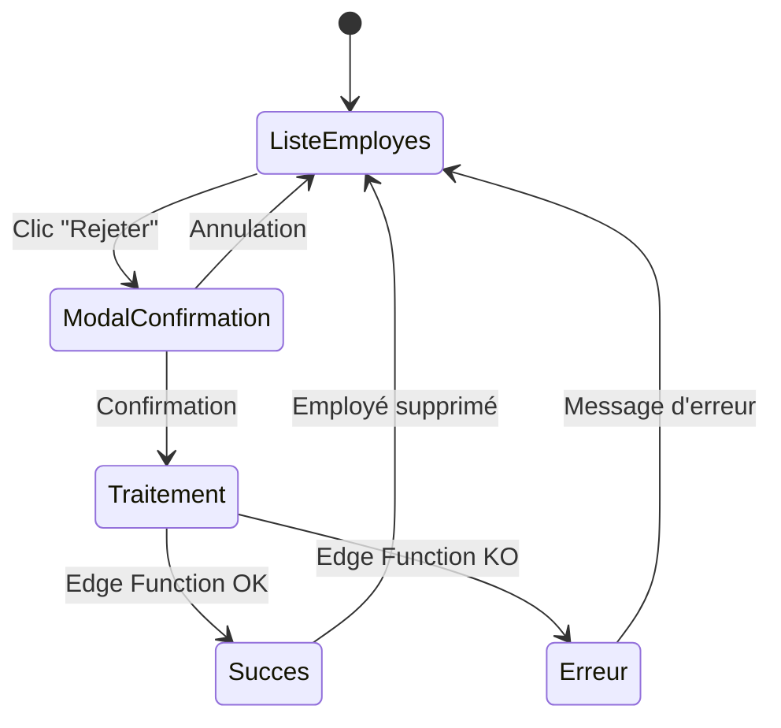
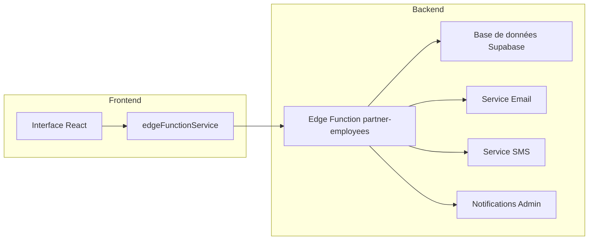
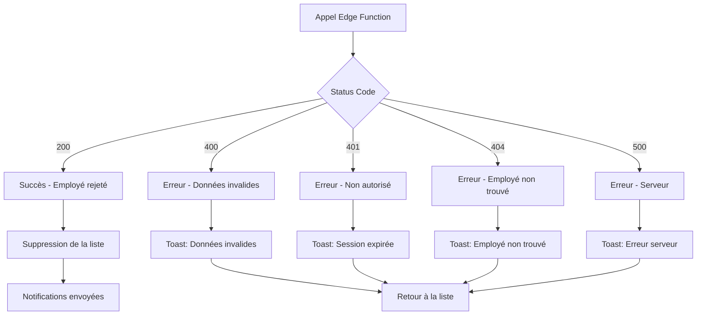
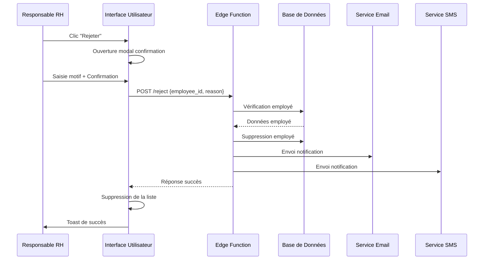

# Flux de Rejet des Inscriptions d'Employés

## Diagramme de Flux

```mermaid
graph TD
    A[RH accède à la page Demandes d'Adhésion] --> B[Liste des employés sans compte]
    B --> C{RH clique sur "Rejeter"}
    C --> D[Ouverture du modal de confirmation]
    D --> E[RH saisit le motif optionnel]
    E --> F{RH confirme le rejet}
    F -->|Oui| G[Appel Edge Function /reject]
    F -->|Non| H[Annulation - Fermeture modal]

    G --> I{Edge Function valide}
    I -->|Succès| J[Suppression de l'employé de la liste]
    I -->|Erreur| K[Affichage message d'erreur]

    J --> L[Envoi notifications]
    L --> M[Email à l'employé]
    L --> N[SMS à l'employé]
    L --> O[Email au partenaire]
    L --> P[Notification admin en BD]

    M --> Q[Toast de succès]
    N --> Q
    O --> Q
    P --> Q

    K --> R[Toast d'erreur]

    H --> B
    Q --> B
    R --> B
```

## États de l'Interface



## Architecture Technique



## Gestion des Erreurs



## Séquence d'Appel API


